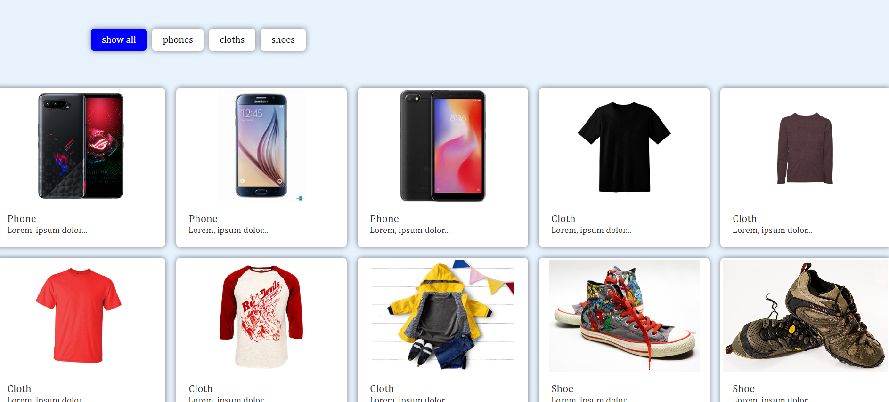

# Image Gallery Filtering Website 📸

This project is a responsive image gallery built with HTML, CSS, and JavaScript. It allows users to filter through different categories (phones, clothes, shoes) using buttons to display relevant images dynamically.

---

## Demo

[Demo](https://naveenkumar-developer.github.io/imageGallery/)

---

## Features 🚀

- **Filter by Category**: View items based on selected categories (phones, clothes, shoes).

- **"Show All" Option**: View all cards at once.

- **Responsive Design**: Works on desktops and mobile devices.

- **Dynamic Filtering**: Cards are displayed/hidden based on the selected category.

- **Simple & Clean Layout** using HTML and CSS.

---

## Technologies Used 💻

- **HTML5**: Structure and layout.

- **CSS3**: Styling the gallery and making it visually appealing.

- **JavaScript**: Adding interactivity for category-based filtering.

---

## Usage 🛠️

1. Click any category button to filter the relevant items.

2. Use the "Show All" button to display all items again.

3. Enjoy a seamless, responsive gallery experience.

